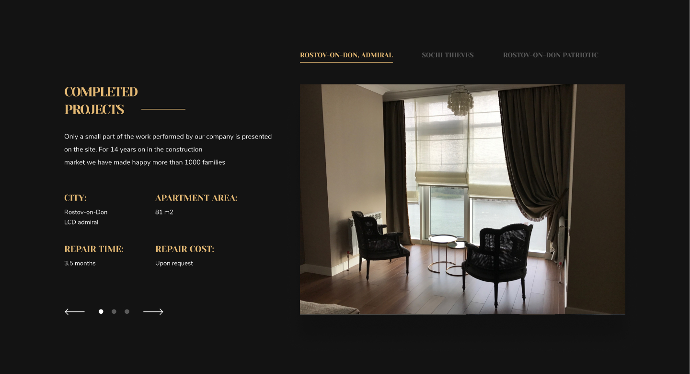
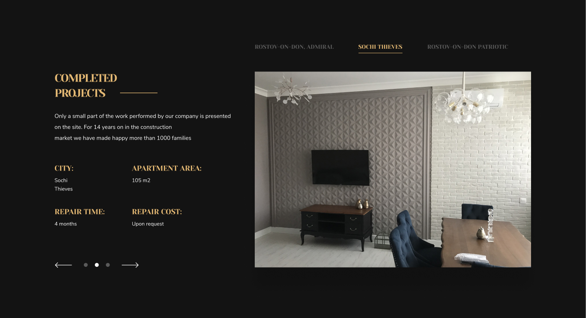
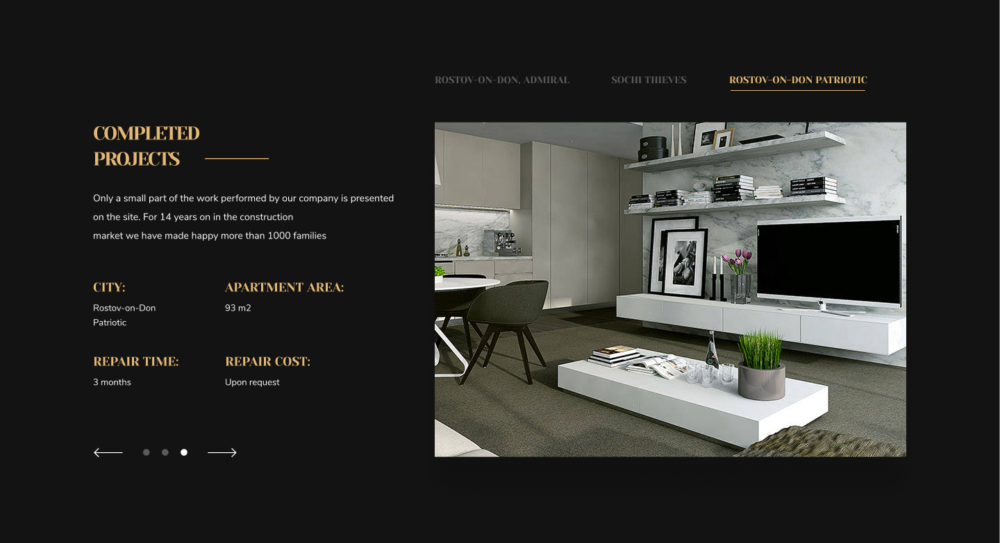

# Курсовой проект слайдер на JavaScript
Основная задача — преобразовать внешний вид сайта, так чтобы на нем менялись изображения и информация об объекте.

Для реализации слайдера использовать следующий макет:

1. 
2. 
3. 

**Управляющие элементы**, которые нужно установить и которые являются условиями проекта:
1. *Стрелки* (переключают слайды по кольцу. То есть после слайда №3 снова пойдет слайд №1);
2. *Кружочки* между стрелками (включают нужный слайд);
3. *Ссылки* сверху слайдера (включают нужный слайд).

